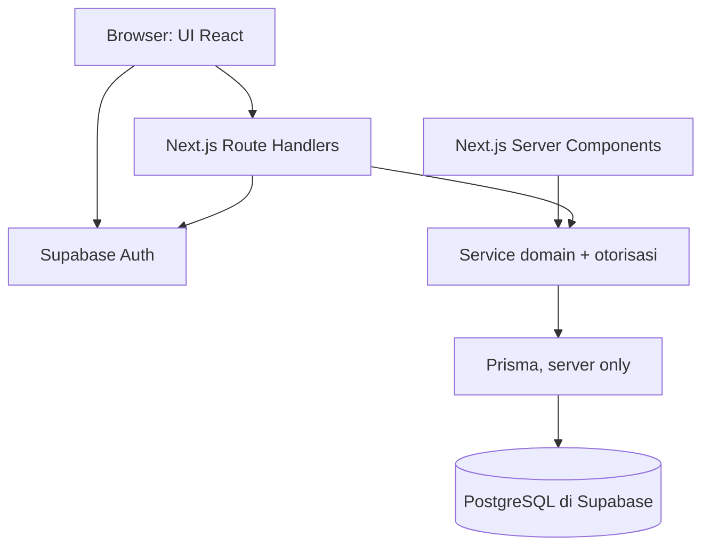

# Stack dan arsitektur — Alokasi

Tanggal: 23 September 2026. Status: frontend/tooling dan fondasi database development diimplementasikan. Auth, CRUD, dan layanan produksi belum dibuat. Status koneksi TLS dan tes terbaru ada di ACCEPTANCE.md.

## 1. Pilihan

| Lapisan | Pilihan | Peran |
|---|---|---|
| Bahasa | TypeScript dengan strict mode | Frontend, backend, validasi, dan pengujian |
| Frontend | React melalui Next.js App Router | Halaman web responsif dan interaksi UI |
| Backend | Next.js Route Handlers, runtime Node.js | Endpoint aplikasi; service domain terpisah dari UI/HTTP |
| Database | PostgreSQL, managed di Supabase | Data relasional dan transaksi atomik |
| ORM/migrasi | Prisma ORM + Prisma Migrate | Query bertipe, schema, dan migrasi terkontrol |
| Autentikasi | Supabase Auth + integrasi SSR resmi | Email/password, verifikasi email, reset password, session |
| Otorisasi | Service aplikasi + Membership PostgreSQL | Owner/Editor/Viewer, workspace, dan izin per objek |
| UI | Tailwind CSS + komponen shadcn/ui + Lucide | Implementasi desain Alokasi; sesuaikan komponen ke DESIGN.md |
| Validasi | Zod | Validasi input server dan skema form bersama |
| Pengujian | Vitest dan Playwright | Domain/integrasi dan alur browser |
| Package manager | npm dengan satu lockfile | Setup familiar tanpa toolchain tambahan |

Chart library dan library form dipilih saat kebutuhan UI terkait diimplementasikan; jangan memasang banyak alternatif sekaligus. Hosting aplikasi, SMTP produksi, provider OCR, dan storage scan masih keputusan deployment/fase lanjutan.

Versi package tidak dikarang di dokumen. Saat bootstrap, periksa versi stabil yang kompatibel dan didukung, gunakan Node LTS yang sesuai, lalu kunci versi melalui lockfile serta catat runtime di repository. Jangan memakai prerelease tanpa alasan khusus.

## 2. Mengapa cocok untuk proyek ini

- Pengguna dapat memakai TypeScript untuk seluruh alur aplikasi, dengan tambahan konsep React, HTTP, SQL, dan autentikasi yang dapat dipelajari bertahap.
- Next.js menyediakan UI dan endpoint dalam satu proyek. Untuk scope Alokasi saat ini, ini mengurangi kebutuhan memelihara dua aplikasi/deployment serta kontrak antarproyek.
- PostgreSQL cocok untuk hubungan ruang–anggota–akun–transaksi–kategori–budget, constraint, dan mutasi keuangan atomik.
- Prisma membuat schema dan query mudah ditelusuri dalam proyek TypeScript. SQL tetap digunakan untuk constraint yang tidak diwakili ORM; jangan menganggap ORM menggantikan pemahaman database.
- Supabase menggabungkan hosting PostgreSQL dan autentikasi sehingga tidak perlu membuat sistem password/reset/session sendiri. Database tetap PostgreSQL; penggantian provider auth di masa depan tetap memerlukan pekerjaan migrasi.
- shadcn/ui memberi kode komponen yang dapat disesuaikan dengan mockup, tanpa harus mengadopsi tema defaultnya sebagai desain produk.

Pilihan ini merupakan penilaian untuk keterampilan pengguna dan scope produk, bukan klaim bahwa stack ini selalu terbaik untuk semua aplikasi.

## 3. Bentuk arsitektur

Satu aplikasi dengan modul terpisah (modular monolith). Backend bisnis tetap ada dan berjalan di server; tidak ditempatkan di browser.



- Server Components mengambil data melalui service server secara langsung, tanpa HTTP ke endpoint internal sendiri.
- Client Components menangani form, dialog, filter interaktif, dan grafik. Mutasi bisnis dipanggil ke Route Handlers.
- Baseline tidak memakai Server Actions untuk mutasi domain agar jalur HTTP dan pengujiannya konsisten. Jika kelak digunakan, actions harus memanggil service yang sama, bukan membuat aturan bisnis kedua.
- Validasi dan otorisasi dijalankan kembali di server untuk setiap operasi, termasuk permintaan baca.
- Prinsip endpoint: resource di bawah `/api/workspaces/[workspaceId]/...`; `workspaceId` dari URL tetap tidak tepercaya sampai membership diperiksa.
- Domain tidak bergantung pada React, Request/Response, atau SDK Supabase. Adapter auth/DB berada di layer server.
- Tidak menambahkan Express/NestJS, microservices, Redis, queue, GraphQL, atau WebSocket ke MVP hanya karena mungkin dibutuhkan kelak.

Struktur tujuan (app/components/lib/tests sudah dibuat; modules/domain/server/prisma ditambahkan pada tahap terkait):

```text
src/
  app/                 # Halaman, layouts, auth callbacks, api route handlers
  components/          # Komponen UI dan komponen tampilan fitur
  modules/
    workspaces/        # Schema input, service, repository
    accounts/
    categories/
    transactions/
    budgets/
    reports/
  domain/              # Uang, tanggal, periode: fungsi murni
  server/
    auth/              # Supabase server client dan verifikasi identitas
    authorization/     # Membership, peran, izin objek
    db/                # Prisma client dan transaksi
prisma/
  schema.prisma
  migrations/
tests/
  integration/
  e2e/
```

Struktur dapat disesuaikan tanpa mengubah batas tanggung jawab. Hindari repository generik yang menerima workspace opsional; operasi bisnis harus meminta konteks ruang terotorisasi.

## 4. Autentikasi versus otorisasi

### Autentikasi

- Supabase Auth menangani identitas, email/password, verifikasi email, login/logout, dan pemulihan password.
- Integrasi Next.js memakai `@supabase/ssr` dan pola cookie/refresh resmi sesuai versi terpasang. Jangan merancang JWT atau tabel password sendiri.
- Server memvalidasi identitas menggunakan metode server SDK yang memverifikasi token, bukan hanya mempercayai objek dari `getSession()` atau decode JWT tanpa verifikasi. Untuk baseline, gunakan `getUser()` pada akses terlindungi; optimasi `getClaims()` harus mempertimbangkan kebutuhan kesegaran status akun/session.
- Proxy/middleware untuk refresh/redirect bukan satu-satunya penjaga data. Setiap endpoint dan service tetap memeriksa identitas, status user aplikasi, dan membership.
- Profil aplikasi memiliki `auth_subject` unik yang memetakan ID Supabase Auth. Provisioning profil dan ruang pribadi harus idempotent agar retry login tidak membuat ruang ganda.
- Prisma hanya mengelola tabel aplikasi; jangan memigrasikan atau memodifikasi schema internal `auth` milik Supabase.
- Penghapusan akun menghapus ruang pribadi lalu menonaktifkan dan menganonimkan user aplikasi dalam transaksi database sebelum cleanup provider. Setelah commit, server melakukan global sign-out dan Auth Admin `deleteUser` memakai `SUPABASE_SECRET_KEY` server-only. Access JWT yang sudah terbit dapat hidup sampai kedaluwarsa, tetapi service aplikasi menolaknya karena `auth_subject` sudah dilepas dan `disabled_at` terisi.
- Verifikasi email dan reset password memerlukan URL callback allowlist yang benar. SMTP/pengiriman email produksi wajib disiapkan dan diuji saat deployment; tidak diasumsikan siap hanya karena login lokal berhasil.

### Otorisasi

- Membership di PostgreSQL adalah sumber role terbaru per workspace, bukan role dari browser atau metadata yang dapat diubah user.
- Periksa membership aktif pada setiap request; jangan menyimpan keputusan akses jangka panjang di cache lintas request.
- Owner/Editor/Viewer mengikuti PRD. Query objek mencakup workspace; edit Editor memeriksa `created_by`.
- Endpoint berbasis cookie menerapkan pemeriksaan origin/CSRF yang sesuai untuk mutasi; GET tidak melakukan mutasi.
- Secret database dan credential admin auth hanya di server. Kunci publishable untuk integrasi auth bukan credential database dan bukan pengganti otorisasi.

## 5. Strategi akses PostgreSQL

**Satu jalur data bisnis: Next.js server → Prisma → PostgreSQL.** Browser tidak mengakses tabel finansial melalui Supabase Data API.

- Gunakan schema aplikasi khusus, misalnya `app`, yang tidak diekspos ke Data API. Nonaktifkan Data API bila tidak digunakan; verifikasi konfigurasi pada proyek yang dibuat.
- Cabut akses tabel/schema aplikasi dari role publik `anon` dan `authenticated`. Pengguna yang memperoleh publishable key tetap tidak boleh membaca tabel bisnis langsung.
- Pisahkan role koneksi runtime dengan hak DML minimum dari role migrasi yang memiliki hak DDL. Jangan memakai superuser atau role contoh dengan hak luas sebagai runtime default.
- Prisma dengan koneksi server tidak otomatis membawa JWT end-user atau menerapkan kebijakan `auth.uid()` pengguna. Baseline menerapkan isolasi workspace di service/repository dan mengujinya. Jangan mengklaim ada RLS per pengguna tanpa implementasi konteks dan policy yang benar.
- Jika kelak akses langsung melalui Data API diperlukan, keputusan arsitektur harus diperbarui beserta grants, RLS, dan pengujian; jangan membuka tabel untuk menyelesaikan masalah query sesaat.
- Gunakan pool koneksi sesuai lingkungan. Runtime serverless memakai konfigurasi transaction pooler yang kompatibel; migrasi memakai direct/session connection sesuai dukungan provider. Uji dengan versi Prisma/adapter yang dipilih.
- Prisma Migrate menjadi jalur migrasi tabel aplikasi. Custom SQL constraints tetap disimpan di migration versioned. Jangan `db push` atau edit manual dashboard sebagai workflow produksi.
- Connection string runtime/migrasi berbeda dan tidak dicetak pada log. Environment development/test/production terpisah.

## 6. Kontrak data penting

- Nominal disimpan sebagai PostgreSQL `BIGINT`, diolah sebagai `bigint` di domain. Batas dan validasi amount ditetapkan eksplisit dalam schema input.
- JSON API mengirim nominal sebagai string digit, misalnya `"125000"`; frontend memformat IDR. Hindari cast diam-diam ke `number` yang dapat kehilangan presisi.
- Jika chart memerlukan number, konversi hanya setelah range check atau memakai nilai terskala; perhitungan domain tetap integer.
- `transaction_date`, `start_date`, dan `end_date_exclusive` memakai SQL `DATE`; timestamp teknis memakai `TIMESTAMPTZ`. DTO tanggal kalender berbentuk `YYYY-MM-DD`, bukan hasil konversi zona waktu browser.
- UUID untuk ID; unique constraint untuk membership, budget per kategori/periode, idempotency key, dan relasi satu draf–satu transaksi saat F18 aktif.
- Gunakan foreign key gabungan workspace dan object ID atau constraint setara untuk mencegah relasi lintas ruang, selain pemeriksaan service.
- Transfer, perubahan transaksi, audit terkait, dan submit draf dijalankan dalam transaksi database yang singkat; network OCR/email tidak berada di dalam transaksi tersebut.
- Version checks/locking dan retry konflik database harus mempertahankan idempotensi. Saldo awal dan transaksi tetap sumber kebenaran; agregat laporan tidak boleh memiliki rumus duplikat yang berbeda.
- Query historis menggunakan BudgetPeriod sejak MVP. Pemilihan stack tidak mengaktifkan F21 atau mengubah batas fase produk.

## 7. Frontend dan pengujian

- Tailwind mengimplementasikan token DESIGN.md. shadcn/ui untuk dialog, select, form, dan komponen yang dibutuhkan; jangan memasang seluruh katalog.
- React state lokal untuk input sementara; parameter URL untuk ruang/periode/filter yang perlu dapat ditautkan. Data server tetap bersumber dari backend.
- PWA installable memakai manifest App Router dan service worker kecil yang diregistrasikan dari Client Component. Service worker hanya menyediakan fallback navigasi ke halaman offline dan tidak mencache data terautentikasi atau mutasi finansial.
- F23 tidak memakai IndexedDB, Background Sync, push notification, atau antrean transaksi. Server/PostgreSQL tetap satu-satunya sumber transaksi tersimpan.
- Zod memvalidasi data di boundary server. Validasi browser adalah bantuan UX, bukan jaminan integritas.
- Vitest: uang, periode, aturan peran, dan validasi. Integrasi memakai PostgreSQL sungguhan khusus test untuk constraint, rollback, concurrency, dan workspace isolation; jangan menggantinya dengan SQLite lalu mengklaim perilaku sama.
- Playwright: login, pindah ruang, transaksi, kategori, budget, serta akses peran pada alur UI.
- Sebelum rilis: lint, TypeScript, build, tes relevan, serta acceptance di ACCEPTANCE.md. Tambahkan perintah yang benar-benar tersedia saat bootstrap, bukan placeholder yang diklaim sudah berjalan.

## 8. Tradeoff dan kapan dievaluasi ulang

| Alternatif | Evaluasi untuk Alokasi |
|---|---|
| React/Vite + NestJS terpisah | Layak jika API melayani banyak klien/tim terpisah; saat ini menambah deployment dan kontrak yang belum diperlukan |
| Next.js + database/auth yang dikelola sendiri | Memberi kontrol operasional lebih besar, tetapi menambah pekerjaan pengiriman email, pemulihan, dan operasi auth |
| Supabase client langsung + RLS/RPC | Layak untuk pendekatan database-centric; baseline memilih domain TypeScript dan transaksi Prisma agar alur bisnis berada di satu service layer |
| Drizzle menggantikan Prisma | Alternatif yang baik jika ingin pendekatan lebih dekat SQL; baseline memilih schema Prisma untuk keterbacaan awal dan konsistensi tooling |

Tradeoff utama pilihan ini: bergantung pada layanan Supabase untuk operasi database/auth dan tetap perlu belajar React/Next.js serta SQL. Biaya, kuota, lokasi data, backup, dan email produksi diverifikasi saat memilih paket; tidak ada janji semua kebutuhan gratis.

OCR tahap 11 memakai Tesseract.js dalam Web Worker browser dengan core WASM dan model bahasa yang disajikan dari origin aplikasi. Worker diimpor dinamis agar tidak menambah jalur awal halaman. Gambar dan teks mentah tidak masuk backend. Provider vision eksternal atau worker server baru dipilih bila evaluasi akurasi lokal tidak memenuhi target; endpoint serverless tidak dijadikan worker tak terbatas. Hosting aplikasi dan storage scan belum dibeli atau diprovision.

## 9. Rujukan resmi yang diperiksa

- [Next.js: Backend for Frontend](https://nextjs.org/docs/app/guides/backend-for-frontend) — jalur server dan Route Handlers.
- [Next.js: Authentication](https://nextjs.org/docs/app/guides/authentication) — pemeriksaan akses di boundary server.
- [Supabase: SSR](https://supabase.com/docs/guides/auth/server-side) — integrasi cookie/server.
- [Supabase: Password authentication](https://supabase.com/docs/guides/auth/passwords) — alur email/password.
- [Supabase: Prisma](https://supabase.com/docs/guides/database/prisma) — koneksi Prisma dan rekomendasi mematikan Data API jika tidak dipakai.
- [Supabase: Securing your API](https://supabase.com/docs/guides/api/securing-your-api) — grants, schema, dan RLS.
- [shadcn/ui](https://ui.shadcn.com/docs) — komponen yang kodenya dapat disesuaikan.
- [Zod](https://zod.dev/) — validasi runtime TypeScript.

Referensi menjelaskan kemampuan teknologi. Struktur service, schema privat, pemilihan ORM, dan fase implementasi di atas adalah keputusan desain Alokasi.

## 10. Versi bootstrap dan batas dukungan

Versi yang terpasang pada penyelesaian tahap 1:

| Komponen | Versi |
|---|---|
| Runtime yang diuji | Node 24.11.1, npm 11.6.2 |
| Next.js / React | 16.3.5 / 19.3.0 |
| TypeScript | 5.9.3 |
| Tailwind | 4.3.3 |
| ESLint / eslint-config-next | 9.39.5 / 16.3.5 |
| Playwright | 1.63.0 |
| Prettier | 3.9.8 |

Pengecualian terhadap target tooling yang masih didukung: ESLint 9.39.5 telah mendapat peringatan end-of-support dari npm. ESLint 10.11.0 sudah dicoba tetapi plugin React bawaan konfigurasi Next gagal memuat aturan (`contextOrFilename.getFilename is not a function`) dan beberapa plugin belum menerima peer ESLint 10. Digunakan pin kompatibel sementara agar pemeriksaan tetap berjalan. Sebelum rilis produksi, upgrade konfigurasi/plugin secara bersama dan uji ulang; jangan menyembunyikan kegagalan dengan mematikan aturan atau memakai force install.

TypeScript terbaru yang terdeteksi registry saat bootstrap berada di luar rentang parser lint yang terpasang; 5.9.3 dipilih sebagai versi kompatibel. Kebenaran versi operasional mengacu pada package.json dan package-lock.json.

Tahap 2 menambahkan Prisma/Client/adapter-pg 7.10.0, pg 8.23.0, Vitest 4.1.11, serta server-only 0.0.1. PostgreSQL Supabase development terverifikasi versi 17.6. Pada penutupan tahap tersebut Supabase Auth SDK dan worker OCR belum dipasang. Prisma 8 prerelease tidak diadopsi. Override dependency transitif dan alasannya tercatat pada T04 di DECISIONS.md; audit instalasi terakhir 0 vulnerability, bukan jaminan bebas risiko.

Tahap 3 menambahkan `@supabase/ssr` 0.12.7, `@supabase/supabase-js` 2.117.1, dan Zod 4.6.5. Endpoint Auth Supabase dapat dijangkau melalui HTTPS. Konfigurasi dashboard, callback, serta batas pengujian email tercantum di AUTH_SETUP.md. Worker OCR tetap belum dipasang.

Tahap 11 menambahkan `tesseract.js` 7.0.0 dan `@tesseract.js-data/eng` 1.0.0. Script postinstall menyalin worker, model, core WASM, serta lisensi ke `public/ocr` yang diabaikan Git sehingga instalasi pada perangkat lain merekonstruksi aset yang sama.

Repository memakai ESM (`type: module`), mendukung skrip Node 24 dan konfigurasi Vitest `.mts`. Prisma client dihasilkan saat instalasi; output generated diabaikan Git. CLI memaksa schema `app`, runtime server-only memakai role minimum, dan semua koneksi remote memaksa TLS `verify-full`. Konfigurasi CA dan status verifikasi dijelaskan di DATABASE_SETUP.md/ACCEPTANCE.md.
